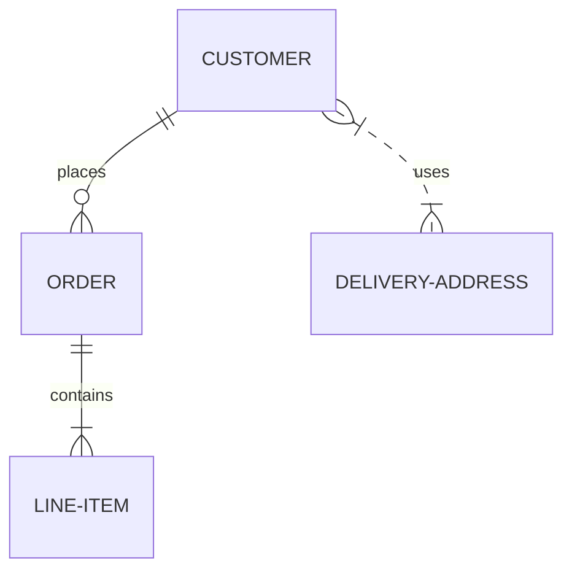

<!-- Примеры -->
<!--  -->

<!-- :white_check_mark: Это уже сделано    
:negative_squared_cross_mark: Я не буду это делать    
:black_square_button: делать или не делать, вот в чем вопрос?   -->

 <h1 align="center">Создание собственного фреймворка.</h1>
Цель: реализовать собственный фреймфорк.
 
Видео: <a hreft= "https://www.youtube.com/user/webformyself">WebForMySelf</a>

- [x] Придумать внешний вид резюме
- [ ] Написать основные категории

- Урок 1
    - Чем полезен процесс написания собственного фреймворка?
    - Что такое маршрутизация?
    - Какова структура адресов фреймворка?
    - Что такое контроллер и экшен (действие)?
- Урок 2
    -  Как использовать регулярные выражения для маршрутизации?
    - Именования и стандарты PSR?
    - Чем может быть полезен стандарт комментирования PHPDoc?
    - Как написать функцию автозагрузки классов?
    - Как описать кастомное правило маршрутизации?
- Урок 3
    - Что такое пространства имен и чем они могут быть полезны?
    - Как написать функцию автозагрузки классов?
    - Как передать параметры в действия контроллеров?
    - Зачем необходим базовый класс Controller?
    - Как передать данные в контроллер при создании его объекта?
- Урок 4
    - В чем разница между шаблонами и видами?
    - Как реализовать автоматическое подключение шаблона и вида?
    - Как изменить подключаемые по умолчанию шаблон и вид?
    - Как отменить подключение шаблона и вида?
    - Как передать данные из контроллера в вид и шаблон?
- Урок 5
    - Что такое модель?
    - Как реализовать шаблон Singleton?
    - Как работать с PDO?
    - Как настроить подключение к БД, используя PDO?
    - Как реализовать простую отладочную панель?
- Урок 6
    - Что такое модель?
    - Как реализовать шаблон Singleton?
    - Как работать с PDO?
    - Как настроить подключение к БД, используя PDO?
    - Как реализовать простую отладочную панель?
- Урок 7
    - Что такое ORM?
    - Как подключить библиотеку RedBeanPHP и настроить соединение с БД?
    - Основные методы CRUD библиотеки RedBeanPHP.
- Урок 8
    - Как получить данные из нескольких таблиц?
    - Как подключить библиотеку RedBeanPHP к фреймворку?
    - Как использовать с пользой родительский контроллер AppController?
- Урок 9
    - Как использовать различные шаблоны для разных страниц?
    - Как добавлять метаданные к страницам?
    - Как выводить блоки по условию в зависимости от страниц?
- Урок 10
    - Что такое шаблоны проектирования?
    - Принцип работы паттерна Registry (Реестр).
    - Как написать базовую реализацию паттерна Реестр?
- Урок 11
- Урок 12
- Урок 13
- Урок 14
- Урок 15
- Урок 16
- Урок 17
- Урок 18
- Урок 19
- Урок 20
- Урок 21
- Урок 22

:white_check_mark: Это уже сделано    
:negative_squared_cross_mark: Я не буду это делать    
:black_square_button: делать или не делать, вот в чем вопрос?

  gitGraph
       commit
       commit
       branch develop
       commit
       commit
       commit
       checkout main
       commit
       commit

